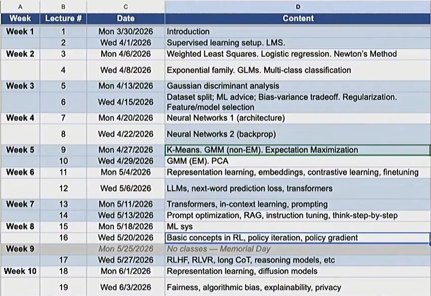

# Lecture 1: Introduction 
Source: https://www.youtube.com/watch?v=DATnpGoGhM8&list=PLaqpC4kq8Gpw

## Definition of Machine Learning
1. **Arthur Samuel (1959)**: Machine Learning is the field of study that gives the computer the ability to learn without being explicitly programmed. 
2. **Tom Mitchell (1998)**: a computer program is said to learn from experience E with respect to some class of tasks T and performance measure P, if its performance at tasks in T, as measured by P, improves with experience E. 
    - Experience E = data
    - Tasks T = request, prompt to be entered
    - Performance measure P = accuracy, end goal 

## Taxonomy of Machine Learning (A Simplistic View Based on Tasks)
The Taxonomy can also be viewed as tools / methods. All 3 fields are intersecting. 
- Supervised Learning
- Unsupervised Learning
- Reinforcement Learning

Supervised Fine-tuning (SFT) is a type of Supervised Learning. 

## Supervised Learning
**Given**: a dataset with inputs (2D, 3D, etc.)     
**Task**: Find fitting fuctions over the graph of data      
(Learn more on Lecture 2 & 3: fitting linear/quadratic functions to the dataset)

### Keywords
- Inputs = Features
- Outputs = Labels

### Regressions vs. Classification
- Regression: if y ∈ ℝ is a continuous variable  
e.g. price prediction
- Classification: the label is a discrete variable   
e.g. the task of predicting the types of residence 

    (size, lot size) &rarr; house or townhouse?
 
(Learn more in Lecture 3-5: Classification)

### High-dimensional Inputs 
x ∈ ℝd for large d   
e.g.  
$$
\begin{bmatrix}
x_1 \\
x_2 \\
x_3 \\
... \\ 
x_d
\end{bmatrix} 
\longrightarrow y
$$ 
**x** &rarr; living size, lot size, # floors, condition, zip code, ...  
**y** &rarr; price 

### Supervised Learning in Computer Vision
- Image Classification (x = raw pixels of the image, y = the main object): clasify the image into categories
- Object localization and detection (x = raw pixels of the image, y = the bounding boxes): determine what's the object through image 

### Supervised Learning in Natural Language Processing
- Machine Translation (e.g. Google Translate)
(To learn more, look into the courses CS224N and CS231N)

### Supervised Learning with Neural Nets (Deep Learning)
- Billions of parameters
- Similar to human brains  
(Learn more on Lecture 7&8)

## Unsupervised Learning 
Dataset contains no labels: x(1), ..., x(n)  
**Goal** (vaguely-posted): to find interesting structures in the data  
**Techniques:**
- **Clustering**: group similar unlabeled data into groups
    - **Types**: k-mean clustering, mixture of Gaussians (Learn more in Lecture 9&10)
    - **Application**: 
        - Clustering Genes
        - **Latent Semantic Analysis (LSA)**:  cluster words (how many) in documents (Learn more in Lecture 10: Principal Component Analysis - tools used in LSA)
        - **Word Embeddings**: represent words by vectors, after that match semantically (word encodes to vector, relation encodes to direction) (Learn more in Lecture 11: Contrasive Learning and Embeddings)

### Large Language Models 
- Pretraining: General-purpose models learnt on unlabeled, massive datasets
    - transformers architecture (Lecture 13)
    - next-word prediction loss (Lecture 12)
- Prompting, instruction tuning, think step by step (Lecture 14)

### Diffusion Model for Image Generation
Generate realistic images from random noise (or instructions)

## Reinforcement Learning
- Learning to make sequential decisions
- Training **stochastic** (involving a random variable, chance, or probability) models with rewards (not a differentiable, well-defined operation)
- The algorithm can collect data interactively (data collection &harr; training)   
(try the strategy and collect feedbacks &harr; improve the strategy based on the feedbacks)  
**e.g.** automated Theorem Proving (given statements, generate proofs, verify, and select the correct ones &harr; train/reinforce the LLM on correct proofs)

### Reinforcement Learning for Training LLMs
Inputs **to** LLM &rarr; Generated texts **to** Human/Reward model &rarr; Reward
- Use the reward as a guidance for updating the LLM to generate better texts 
- RL is needed partly because the LLM generation are stochastic and thus not directly differentiable   
(Learn more on Lecture 16&17: Policy Gradient, **RLVR** - RL with Verifiable Rewards, **RLHF** - RL from Human Feedback, long **CoT** - Chain-of-Thought)

## Timeline of the Course
